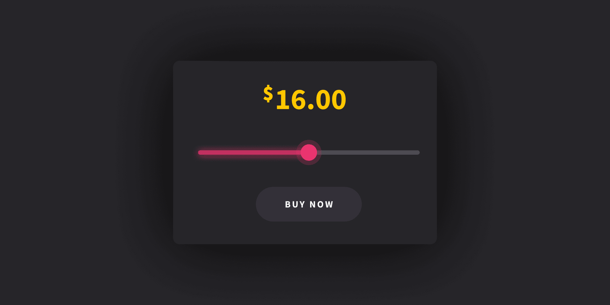

# En este proyecto, vamos a crear un control deslizante de rango. A medida que mueva la perilla, se actualizará el monto en dólares anterior.

##  Mueva la perilla en el rango y la cantidad en dólares arriba se actualizará

Challenge by Make It Real !